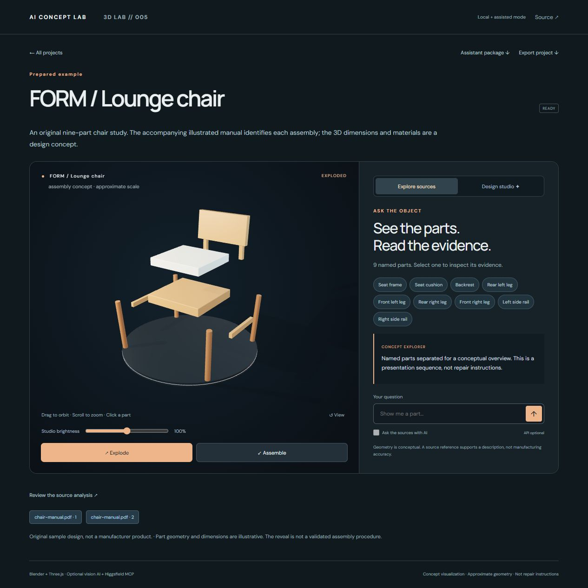

# Inside Anything — 3D LAB // 005

**Give your product manual a new dimension.** Upload photos or a PDF, review the source evidence, and build an explorable conceptual model. The espresso machine is now one example, alongside a lounge chair and desk fan.



## Run

Install Node.js 22.13+ (tested locally with Node 24), then:

```sh
npm ci
npm run build
npm start
```

Open **http://127.0.0.1:3018**. The three prepared examples, source-page viewer and material presets work without API keys. WebGL 2 is required. The optional Google Fonts request has system-font fallbacks.

## Start with your own object

1. Upload PNG, JPEG, WebP or PDF sources. Limits: 4 files, 8 MB each, 12 MB combined, 20 pages per PDF, 24 pages/images combined.
2. Choose one generation route:
   - **Vision API:** configure `.env`, select the one-call consent box, then **Analyze sources**. Your rendered source pages and extracted text are sent to OpenAI.
   - **Connected assistant:** download **Assistant package**, give it to your assistant, follow its included instructions, and import the returned `scene.json`. See [Higgsfield / MCP setup](docs/HIGGSFIELD-MCP.md).
3. Review the object name, part labels, evidence tags, page citations and limitations.
4. Select **Build this concept**. The trusted geometry builder creates separate named parts. With local Blender configured, it also writes a GLB and editable `.blend`; otherwise the browser displays the validated scene directly.
5. Explore, select parts, open their source pages, change the lighting and finishes, and export your project.

**This is a prototype for source-guided visualization, not arbitrary-object CAD reconstruction.** The current generator constructs approximate geometry from bounded primitives. Complex organic shapes, exact dimensions, internal mechanisms and manufacturing fits are outside its scope.

| Evidence | Expected result |
|---|---|
| Exterior photo(s) | Approximate exterior concept; explosion disabled |
| Illustrated manual or parts diagram | Separate conceptual parts when the evidence supports them |
| Photos + illustrated manual | Appearance and documented part evidence together |
| Text-only / insufficient visual evidence | Source knowledge view without invented geometry |

A citation supports a part's identity or description; it does not certify its geometry. Visual-only citations have no quoted text. PDF text is extracted where available; scanned pages are sent as images to the optional vision model, not processed by a separate local OCR engine.

## Optional configuration

Copy `.env.example` to `.env`. Set `OPENAI_API_KEY` and a vision-capable `OPENAI_MODEL` available to your account. `OPENAI_VISION_MODEL` can override the analysis model. Restart the server after changing configuration.

For editable Blender outputs, install [Blender](https://www.blender.org/download/) and set `BLENDER_PATH` to its executable. The build runs in a separate background process with a reduced environment and a trusted script; AI never supplies executable Python to the local worker. The script uses scene JSON with bounded geometry, colors and transforms.

Source analysis is one explicit paid request, capped at two calls per project by default. No automatic retries run after a timeout or interrupted job. Successful analysis is reused. Source questions and AI look generation are separate explicit API requests. Provider pricing depends on the chosen model and input pages; the app does not estimate a price. Presets and local builds make no paid calls.

**Live API verification:** the adapter has passing request/response, failure and citation-validation tests. No live OpenAI source-analysis call was performed for this release because no key was configured. The manual-import → local Blender → interactive model path was tested end to end. A chair was also built and rendered in the connected Higgsfield 3D Jutsu environment. Prepared examples are authored fixtures, not evidence of automatic AI reconstruction.

## Ask and redesign

Without a key, select a part or use commands such as “show me the cushion”, “explode” and “assemble”. With **Ask the sources with AI** enabled, questions use this project's evidence and return validated part/page IDs. Missing evidence should be reported as unknown; generated answers still need human review.

**Design studio** applies finishes and cinematic key/fill/rim lighting to any renderable project. Three prepared looks are included. Optional AI generates a bounded material/light recipe; it does not generate new geometry or textures. Undo, brightness, Save and Load work locally. Look recipes are separate JSON downloads; they do not overwrite a Blender file or persist automatically when switching projects.

## Files, privacy and scope

- Uploaded sources, rendered pages, job records and builds live under gitignored `data/projects/`.
- Projects survive restarts. Interrupted jobs do not silently resubmit provider requests.
- Export ZIPs contain project/scene metadata, source files and page images, plus GLB/Blender outputs when present. Exported models open in normal 3D software; the ZIP is not a one-click project restore format.
- The server binds to loopback and checks host/origin. This is a trusted single-user local tool, not a hardened public upload service. Do not expose it to the internet without authentication, quotas and an isolated document-processing service.
- The app does not inherit your assistant's Higgsfield login. No standalone Jutsu REST integration was verified; the documented MCP-assisted path is explicit.
- ARC's original authored model and illustrated water route remain available. Generic scenes use presentation offsets, not inferred repair/disassembly rules. The original dependency-engine module remains as a legacy example, not the new upload workflow.

## Build, test and publish

```sh
npm run check
npm audit --registry=https://registry.npmjs.org
```

See [BUILD.md](BUILD.md), [MCP setup](docs/HIGGSFIELD-MCP.md), [QA record](docs/QA.md), and [Instagram package](marketing/README.md).

Includes two original illustrated sample manuals, three sample models, source code, Blender builders, tests and a GitHub Actions workflow. The repository keeps its existing URL to preserve already-published links.

MIT-licensed code and original assets. Platform names and third-party libraries retain their respective trademarks and licences.
