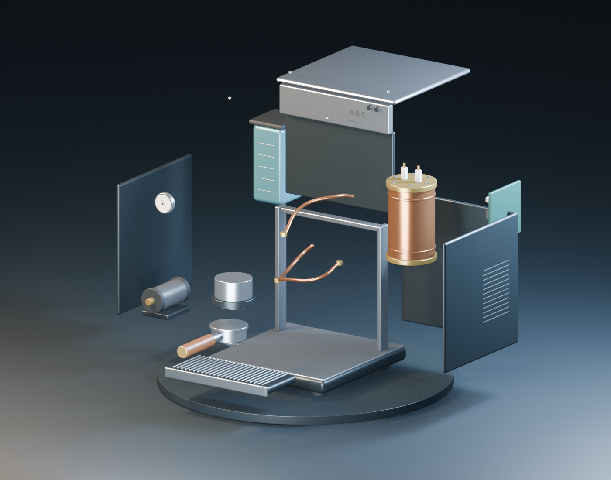
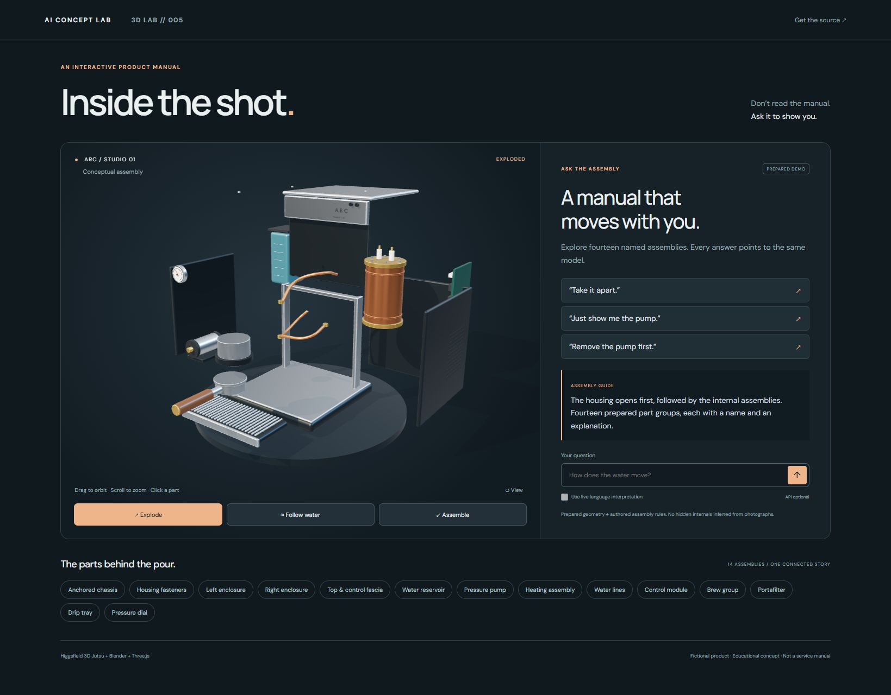

# Inside the Shot — 3D LAB // 005

**This manual takes itself apart.** A fictional espresso machine becomes an interactive, conversational product manual.



## Run in three commands

Install Node.js 22.12+ (Node 24 LTS also works), then:

```sh
npm ci
npm run build
npm start
```

Open **http://127.0.0.1:3018**. The included model and prepared command mode need no keys, Blender installation or paid service. WebGL 2 is required. Google Fonts is optional; system fonts work offline.

## Try it

1. **Explode**: the fasteners release, the enclosure moves out, then the internals separate.
2. **Follow water**: animated markers follow a prepared reservoir → pump → heater → brew-group route.
3. **Just show me the pump**: other parts become transparent; the explanation comes from the part catalogue.
4. **Remove the pump first**: resets to the assembled model and demonstrates a blocked removal. Click the listed prerequisites in order, then remove the pump.
5. **Assemble**: every part returns to its stored rest position.

Drag to orbit, scroll to zoom, click geometry or use the fourteen keyboard-accessible part buttons. Reduced-motion preferences shorten transitions and stop moving flow markers.



## Optional live language mode

Copy `.env.example` to `.env`, set `OPENAI_API_KEY` and an available `OPENAI_MODEL`, then restart `npm start`. Enable **Use live language interpretation** in the app. The model maps language to a bounded action and part ID using the Responses API and a strict JSON schema. The same local engine validates the command and enforces dependencies; the model cannot run JavaScript or edit geometry. Knowledge text comes from the prepared catalogue, not an unrestricted generated maintenance answer.

Prepared mode uses a small phrase router and is explicitly labelled. Live mode incurs API usage; no API key is shipped. Your question is sent to OpenAI only when live mode is selected. The server binds to loopback and checks host/origin. Add authentication, per-user limits and deployment hardening before hosting a paid API publicly.

## What is included

- Three.js viewer and Anime.js part animations
- Fourteen semantic assemblies, dependency graph and explanatory part knowledge
- Optional server-side language interpreter
- Editable `public/model/arc.blend`, portable `arc.glb`, and reproducible Blender script
- [Build instructions](BUILD.md) and [Higgsfield / MCP setup](docs/HIGGSFIELD-MCP.md)
- Five 1080 × 1350 carousel images, caption, comment/DM templates and reel exports in `marketing/`
- Automated behaviour/API/asset checks and GitHub Actions workflow

## Scope

ARC is an original **conceptual assembly**, not a real manufacturer's machine. Hidden internals were prepared, not reconstructed from exterior photographs. The dependency graph is authored; it does not calculate collisions, pressure, temperature or safe service procedures. The water route is an illustration. Part placement and dimensions support a visual explanation, not manufacturing or repair.

Higgsfield 3D Jutsu was used for the editable cloud scene; local Blender builds the distributable model and reproducible renders from the same source. The web app runs those included assets directly. Higgsfield is not called on every interaction.

## Validation

```sh
npm run check
npm audit --registry=https://registry.npmjs.org
```

See [QA notes](docs/QA.md) for the checks actually performed and the boundary of live API testing.

The primary frontend bundle is approximately 180 KB gzipped, including Three.js; Vite reports a size advisory for the uncompressed 694 KB bundle. This POC intentionally keeps the viewer in one bundle.

MIT-licensed code and original model. Third-party libraries and platform names retain their own licences and trademarks.
